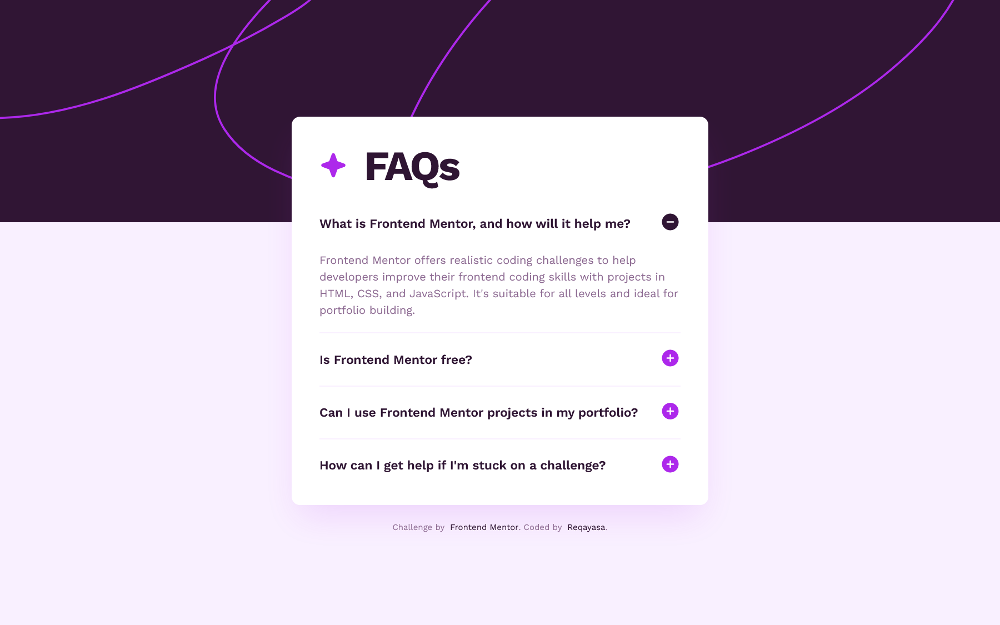

# Frontend Mentor - FAQ accordion solution

This is a solution to the [FAQ accordion challenge on Frontend Mentor](https://www.frontendmentor.io/challenges/faq-accordion-wyfFdeBwBz). Frontend Mentor challenges help you improve your coding skills by building realistic projects.

## Table of contents

-   [Overview](#overview)
    -   [The challenge](#the-challenge)
    -   [Screenshot](#screenshot)
    -   [Links](#links)
-   [My process](#my-process)
    -   [Built with](#built-with)
    -   [What I learned](#what-i-learned)
    -   [Useful resources](#useful-resources)
-   [Author](#author)

**Note: Delete this note and update the table of contents based on what sections you keep.**

## Overview

### The challenge

Users should be able to:

-   Hide/Show the answer to a question when the question is clicked
-   Navigate the questions and hide/show answers using keyboard navigation alone
-   View the optimal layout for the interface depending on their device's screen size
-   See hover and focus states for all interactive elements on the page

### Screenshot

### Links

-   Solution URL: [GitHub](https://github.com/reqayasa/fmr-faq-accordion-main/)
-   Live Site URL: [Vercel](https://fmr-faq-accordion-main.vercel.app/)

## My process

### Built with
-   [Tailwind CSS](https://tailwindcss.com/) - CSS Framework

### What I learned

I this challange i learned basic of Tailwind CSS, layout with tailwind, using pseudo element, addning javascript, adding custome theme, and adding custome component.

In term of UI design i learned about accordion, how to use that, what is the best practice and more. Even thought i not able to implement everythings.

### Useful resources

-   [Tailwind Accordions](https://parsinta.com/articles/membuat-accordion-dengan-pure-tailwind-css) - This explain how to create accordian in tailwind without javascript.
-   [CSS and Javascript Accordions](https://www.w3schools.com/howto/howto_js_accordion.asp)
-   [How to properly navigate accordion using keyboard according to WCAG recommendations.](https://www.pixelemu.com/blog/web-development/336-how-to-properly-navigate-accordion-using-keyboard-according-to-wcag-recommendations)

## Author

-   Frontend Mentor - [@reqayasa](https://www.frontendmentor.io/profile/reqayasa)

